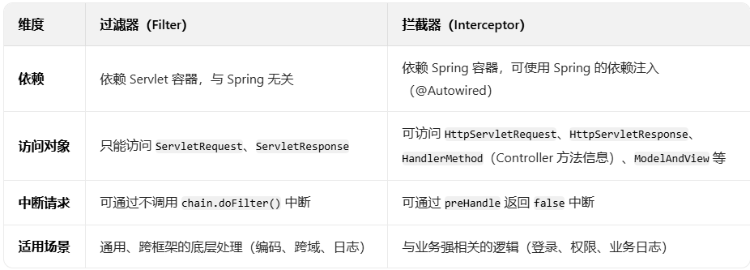

# springBoot-MynatisPlus-pro

# servlet容器
一、什么是 Servlet 容器？
    Servlet 容器（Servlet Container）是 实现了 Servlet 规范的运行环境，它是 Java Web 应用的 “宿主”，负责管理 Servlet 的生命周期、处理 HTTP 请求 / 响应，并提供 Servlet 运行所需的底层支持。
Servlet 容器的核心功能：
    1、管理 Servlet 生命周期：
        负责 Servlet 的加载、实例化、初始化（init()）、调用服务（service()）、销毁（destroy()）等全生命周期管理。
    2、处理 HTTP 通信：
        接收客户端的 HTTP 请求（如浏览器的请求），解析请求信息（URL、参数、 headers 等），并将其转换为 Servlet 能理解的 ServletRequest 对象；
        待Servlet 处理完业务后，将返回的 ServletResponse 对象转换为 HTTP 响应，发送给客户端。
    3、提供基础服务：
        包括会话管理（HttpSession）、请求分发（根据 URL 匹配对应的 Servlet）、安全控制（如身份验证）、线程管理（多线程处理并发请求）等。
二、Tomcat 是 Servlet 容器吗？
    是的，Tomcat 是最经典的 Servlet 容器。
    Tomcat 不仅实现了 Servlet 规范（如 Servlet 3.1、4.0 等版本），还实现了 JSP 规范（JSP 本质是 Servlet 的简化版），因此它能直接运行 Servlet 和 JSP 编写的 Java Web 应用。
三、总结
    Servlet 容器是 遵循 Servlet 规范的运行环境，核心作用是管理 Servlet 并处理 HTTP 通信；
    Tomcat 是 Servlet 容器的典型实现，能直接运行 Servlet/JSP 应用，是 Java Web 开发中最常用的容器之一
# 过滤器和拦截器
一、技术本质：规范与框架的区别
过滤器（Filter）：
    是 Servlet 规范 定义的组件（属于 Java EE 标准），依赖于 Servlet 容器（如 Tomcat）运行，与 Spring 框架无关。
它的诞生早于 Spring，本质是对 HTTP 请求的 “横向拦截”，无论后端用什么框架（甚至不用框架，纯 Servlet），只要符合 Servlet 规范，过滤器就能生效。

拦截器（Interceptor）：
    是 Spring MVC 框架 提供的组件（属于 Spring 生态），依赖于 Spring 容器，本质是对 Spring MVC 请求流程的 “纵向嵌入”。
它只能在 Spring MVC 接管的请求中生效（即通过 DispatcherServlet 分发的请求），核心是嵌入到 Controller 调用的前后，处理与业务强相关的逻辑。

二、作用范围：“外” 与 “内” 的边界
可以用一个比喻理解：
过滤器像 “小区大门保安”：所有进入小区（Servlet 容器）的人（HTTP 请求）都要经过检查，无论最终去哪个楼栋（Controller），甚至去小区公共区域（如静态资源）也会被拦截。
 ·拦截范围：所有通过 Servlet 容器的请求（包括静态资源、JSP、Servlet、Controller 等）。
 ·典型场景：编码设置（CharacterEncodingFilter）、跨域处理（CorsFilter）、全局日志、请求参数过滤（如防 XSS）等通用功能。

拦截器像 “楼栋门禁”：只针对进入特定楼栋（Controller）的人（请求）生效，对小区公共区域（静态资源）或其他非楼栋区域（如直接访问 Servlet）不拦截。
 ·拦截范围：仅 Spring MVC 接管的请求（即通过 @Controller 或 @RestController 处理的请求）。
 ·典型场景：登录验证（未登录则拦截）、权限校验（角色不符则拦截）、业务日志（记录接口调用者和结果）、接口耗时统计等与业务强相关的逻辑。

三、执行时机：请求处理的 “时间轴”
从一次 HTTP 请求的完整流程看，两者的执行顺序和阶段不同：
客户端请求 → 过滤器（Filter） → Servlet 容器 → DispatcherServlet → 拦截器（preHandle） → Controller → 拦截器（postHandle） → 拦截器（afterCompletion） → 过滤器 → 客户端响应

过滤器：仅在 请求进入 Servlet 容器后、到达 Servlet 前 执行一次（doFilter 方法），以及 响应返回客户端前 执行后续处理（通过 FilterChain 链式调用）。
拦截器：有三个执行点：
preHandle：Controller 执行前（可决定是否放行，返回 false 则中断请求）；
postHandle：Controller 执行后、视图渲染前（可修改响应数据）；
afterCompletion：整个请求完成后（如释放资源、记录异常）。

四、能力边界：能做什么，不能做什么

总结
你的理解核心是对的：

过滤器是 Servlet 容器级别的 “通用拦截器”，作用于所有请求，处理底层、跨框架的逻辑；
拦截器是 Spring MVC 级别的 “业务拦截器”，作用于 Controller 请求，处理与业务绑定的逻辑。